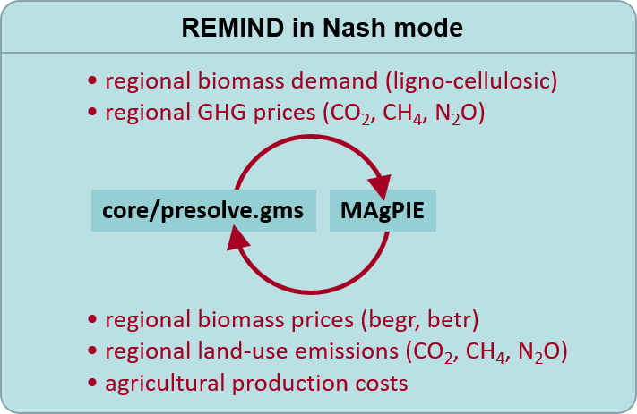

Running REMIND and MAgPIE in coupled mode
================
David Klein (<dklein@pik-potsdam.de>)

## Summary of new MAgPIE-Nash coupling

The previous coupling, in which REMIND and MAgPIE run sequentially, has been replaced with shifting the MAgPIE runs between the Nash iterations. `start_bundle_coupled.R` and `start_coupled.R` have been removed. Use `start.R` together with a `scenario_config_magpie*.csv` file (formerly known as `scenario_config_coupled.csv`) specifying your MAgPIE settings and a `scenario_config*.csv` file specifying your REMIND seeting to activate the MAgPIE coupling, e.g.
```
Rscript start.R config/scenario_config_magpie*.csv
```
The new coupling is mainly perforemd in `core/presolve.gms`, by calling the R script `scripts/input/magpie.R`, that transfers the data of the latest Nash solution to MAgPIE, runs MAgPIE, and transfers the MAgPIE data to a `magpieData.gdx`. Then REMIND GAMS continues, reads the `magpieData.gdx` and continues the Nash iterations.

If you need to continue runs to yield a better convergence, paste the path to a previous REMIND or MAgPIE report into the column `continueFromHere`  in the `scenario_config_magpie.csv` and start the respective scenario. 

Create convergence plots for individual runs with
```
Rscript output.R -> single -> plotRemMagNash.R
```
and for continued runs with
```
Rscript output.R -> comparison -> plotRemMagNash.R
```

# Table of contents

- [Running REMIND and MAgPIE in coupled mode](#running-remind-and-magpie-in-coupled-mode)
- [How to start coupled runs](#how-to-start-coupled-runs)
    + [Clone the models](#clone-the-models)
    + [Switch to relevant branchs](#switch-to-relevant-branchs)
    + [What happens during a single coupled run](#what-happens-during-a-single-coupled-run)
    + [What happens during a bundle of coupled runs](#what-happens-during-a-bundle-of-coupled-runs)
    + [Configure the config files of your choice](#configure-the-config-files-of-your-choice)
    + [Perform test start before actually submitting runs](#perform-test-start-before-actually-submitting-runs)
    + [Start runs after checking that coupling scripts finds all gdxes and mifs](#start-runs-after-checking-that-coupling-scripts-finds-all-gdxes-and-mifs)
- [Check the convergence](#check-the-convergence)
- [Technical concept](#technical-concept)
    + [Dynamic part](#dynamic-part)
    + [Static part](#static-part)
    + [Assumptions](#assumptions)
    + [The coupling scripts](#the-coupling-scripts)

# How to start coupled runs

### Clone the models

If you work on the PIK cluster, first fork both https://github.com/magpiemodel/magpie.git and https://github.com/remindmodel/remind.git on your own github account, and then run
```bash
clonerempie githubuser [remindfolder]
```
If `remindfolder` is not specified, it uses "remind".

If you are not on the cluster, you can use the following to get a magpie folder within your remind folder:
```bash
git clone --filter=blob:limit=1m https://github.com/remindmodel/remind.git; cd remind; git clone https://github.com/magpiemodel/magpie.git
```

### Switch to relevant branchs

For both models switch to the git branches you want to use for your runs, for example the `develop` branch for most recent developments, or the `master` branch for a stable release:

```bash
git checkout develop
```

### Start coupled runs

Use `start.R` together with a `scenario_config_magpie*.csv` file (formerly known as `scenario_config_coupled.csv`) to activate the MAgPIE coupling, e.g.

```
Rscript start.R config/scenario_config_magpie.R
```

The new coupling is mainly perforemd in `core/presolve.gms`, by calling an external R script, that transfers the data of the latest Nash solution to MAgPIE, runs MAgPIE, and transfers the MAgPIE data to a `magpieData.gdx`, which is then read by GAMS.

### What happens during a single coupled run

You can find a more technical explanation in the sections below, but the start script is essentially creating new runs of each model that use previous runs as input. These runs' names follow a specific pattern of suffixes and prefixes, and "communicate" through ".mif" reporting files.

<a href="figures/4-REMIND-MAgPIE-circle.png"></a>

Here's an example of a simple case. If you start a new coupled run with the scenario name `Base`, which doesn't depend on any other run, the script will:

   - Set up and start a normal REMIND run called `C_Base_timestamp`, based on the configurations in `scenario_config.csv` and `scenario_config_magpie.csv`
   - Everytime the Nash loop reaches an iteration that is defined im `c_magpieIter`, set up a MAgPIE run, in the folder 'magpie' within the REMIND main folder, called `C_Base_timestamp-mag-1`. This run will be configured to:
      - Take the bioenergy demands and GHG prices from the previous REMIND run's reporting output, in `path_remind/output/C_Base_timestamp/REMIND_rem2mag-1.mif.mif`
      - Take other MAgPIE configurations from the `magpie_scen` column in `scenario_config_magpie.csv`.
   - After that MAgPIE run finishes, continue REMIND with the next Nash iterations, which will:
      - Take bioenergy prices and land-use GHG emissions from the previous MAgPIE run's reporting output, in `path_magpie/output/C_Base_timestamp-mag-1/report.mif`

This process will continue until for as many MAgPIE iterations as set in `c_magpieIter` in `main.gms`, usually `20,24,28,32`, even if Nash would have converged earlier. This guarantees that all MAgPIE iterations are actually run. (see Check the Convergence below).

The output of both models can be analyzed normally from these two runs. The REMIND `.mif` file contains also the MAgPIE variables.

So, in the end of the coupled run in this example, you should have a directory structure like:

```
|-- path_remind       # the path to the REMIND model folder
    |-- output
        |-- C_Base_timestamp
    |-- magpie       # the path to the MAgPIE model folder
        |-- output
            |-- C_Base_timestamp-mag-1
            |-- C_Base_timestamp-mag-2
            |-- C_Base_timestamp-mag-3
            |-- C_Base_timestamp-mag-4
```

### What happens during a bundle of coupled runs

Regarding a cascade, the coupled runs behave exactly like standalone runs, except that MAgPIE runs in between the Nash iterations. Please see [`03_RunningBundleOfRuns`](./03_RunningBundleOfRuns.md).

### Configure the config files of your choice

The coupled config file you passed along with `start.R` from [`./config/`](../config) starts with `scenario_config_magpie*.csv` and provides some extra information for coupled runs (e.g. which run should be started, specific MAgPIE configurations), with one scenario per row and settings on the columns. The REMIND settings will be taken from the corresponding normal `scenario_config*.csv`, as explained in [`03_RunningBundleOfRuns`](./03_RunningBundleOfRuns.md). Every scenario to be run must be present in both files.

All the columns must be present in the `scenario_config_magpie.csv` file, but most of them can be left blank. The required ones are:

   - `title`: The name of the scenario, must be unique and match the `title` column in REMIND's `scenario_config.csv`
   - `start`: Defines if a scenario run should be started (1) or not (0). Overrides whatever is set in REMIND's `scenario_config*.csv`.
   - `magpie_scen`: A pipe (`|`) separated list of configurations to pass to MAgPIE. Each entry should correspond to a column in [MAgPIE's scenario_config](https://github.com/magpiemodel/magpie/blob/master/config/scenario_config.csv), each one of them setting the multiple configuration flags listed in that file. The configurations are applied in the order that they appear. For example, to configure MAgPIE with SSP2 settings and climate change impacts according to RCP45 set `magpie_scen` to `SSP2|cc|rcp4p5`. To select scenarios from a different `scenario_config*.csv` file replace `magpie_scen` by the path to that file relative to MAgPIE's main folder, for example: `config/projects/scenario_config_PROJECT.csv`. The filename *must contain* the string `scenario_config`. You can also specify more than one column, directing to another `scenario_config_PROJECT2.csv` file. They will be evaluated in the order in which they appear in the `scenario_config_magpie.csv`. There is another option of addressing MAgPIE switches described at the end of the list of optional columns below.
   - `no_ghgprices_land_until`: Controls at which timestep in the MAgPIE runs GHG prices from REMIND will start to be applied. This essentially enables you to set whether or not (or when) GHG prices on land should be applied in MAgPIE. If you want MAgPIE to always apply the same GHG prices from REMIND, you should set this to a timestep corresponding to the start of your REMIND run, such as `y2020` to start in the 2020 timestep. If you want to disable GHG prices in MAgPIE, regardless of what REMIND finds, set this to the last timestep of the run (usually `y2150`). Values in between allow the simulation of policies where GHG prices are only applied in the land use sector after a certain year.

Other, optional columns allow you to make a run start only after another has finished, set starting conditions, and give you finer control over which data is fed from REMIND to MAgPIE or from MAgPIE to REMIND.

   - `continueFromHere`: If the coupling has not yet converged and you want to continue iterations to improve the convergence, provide a path to a REMIND repoting or fulldata.gdx or a MAgPIE report here and start the run again. If provided REMIND will continue from there, meaning:
     - if a REMIND output was provided, it will start a MAgPIE run before the first Nash iteration and use the REMIND output as input for it
     - if a MAgPIE output was provied, it will start the Nash iterations as usual and use the MAgPIE output as input
   - `magpieIter` Use this to specify the Nash iterations in which MAgPIE runs, overwriting what is defined in `c_magpieIter` in `main.gms`.
   - `path_mif_ghgprice_land`: This setting allows MAgPIE to be run using an exogenous, fixed GHG price path, regardless of the GHG price in the REMIND coupling. This can be useful if you want to simulate different GHG pricing policies in the land-use sector. Its timing is also controlled by `no_ghgprices_land_until`.
      - As with the `path_gdx*` settings, this can be set both to the full path of a REMIND `.mif` reporting file (*not* a `.gdx`) or to the name of another scenario. If set to the name of another scenario, it will also wait for that run to finish before starting the dependent run as described.
   - `cfg_mag$...`: If you don't want to select composed scenarios in MAgPIE to address switches, you can directly address individual MAgPIE switches in the `scenario_config_magpie.csv`. Add any number of columns to your `scenario_config_magpie.csv` that have the name of the MAgPIE switch as the column name. They need to start with `cfg_mag$`. For example: if you want to set `gms$s56_cprice_red_factor` to `3.14` for `SSP2-NPi`, add the column `cfg_mag$gms$s56_cprice_red_factor` to your `scenario_config_magpie.csv` and fill in `3.14` in the row that defines `SSP2-NPi`.
   - `path_gdx`, `path_gdx_ref`, `path_gdx_refpolicycost`, `path_gdx_carbonprice`, `path_gdx_bau`: CURRENTLY NOT SUPPORTED. PLEASE USE THE RESPECTIVE COLUMNS IN `scenario_config.csv`! See [`03_RunningBundleOfRuns`](./03_RunningBundleOfRuns.md) for a detailed explanation.

### Perform test start before actually submitting runs

The `--test` (or `-t`) flag shows you if the scripts find all information that are crucial for starting the coupled runs, such as gdxes, mifs, model code.

```bash
Rscript start.R --test config/scenario_config_magpie.csv
```

If you want to check whether your REMIND settings compile, run

```bash
Rscript start.R  --gamscompile config/scenario_config_magpie.csv
```

A shortcut for these commands is `-t` and `-g`.

If you pass `--interactive` as a flag, the script asks you to choose the scenario to be started.

You can use `Rscript start.R config/scenario_config_magpie.csv | tee -a start_log.txt` (or a different filename) if you want to save the log of this procedure to a file, additionally to printing it to the screen.

# Check the convergence

There is no automatic abort criterion for the coupling iterations. The number of coupling iterations is given by the user (`c_magpieIter` in `main.gms`) and will be performed regardless of the quality of convergence. The convergence can be checked, however, by tracking the changes of crucial coupling variables (such as bioenergy demand and prices, GHG emissions and prices) across coupling iterations. After the run finished, a pdf showing these changes is produced automatically that can be found in the common `output` folder of REMIND. If you want to create this pdf for one or more scenarios specifically please provide the names of these runs as follows:

```bash
Rscript output.R
```
- choose `single` and then `plotRemMagNash` to treat each run individually and produce one pdf per run
- or choose `comparison` and then `plotRemMagNash` if you want to plot all coupling iterations of a run and all runs that continued it into one single pdf. See `continueFromHere` above.

# Technical concept

There are two components of the REMIND-MAgPIE coupling: the prominent dynamic part (models solve iteratively and exchange data via coupling script), the more hidden static part (exogenous assumptions derived from the other model, updated manually from time to time via [`mrcommons`](https://github.com/pik-piam/mrcommons/blob/master/R/readMAgPIE.R)).

### Dynamic part

* bioenergy demand, GHG prices from REMIND to MAgPIE (technical: getReportData in [`startfunctions.R`](https://github.com/magpiemodel/magpie/blob/master/scripts/start_functions.R))
* bioenergy prices, GHG emissions from MAgPIE to REMIND (technical: getMagpieData in [`magpie.R`](https://github.com/remindmodel/remind/blob/develop/scripts/input/magpie.R))

### Static part

* bioenergy supply curves in REMIND derived from MAgPIE (updated in coupled runs)
* CO2 MAC: currently deactivated due to negligible differences in CO2 LUC emissions across RCPs
* CH4/N2O MAC (turned on in REMIND standalone, turned off in REMIND coupled because abatement is part of MAgPIE)
* GHG emission baselines for SSPs/RCPs (delivered to REMIND via (updated in coupled runs)
* total agricultural production costs (fixed for standalone and coupled)

Please find a detailed list of the REMIND input files and were they come from [in the gitlab wiki](https://gitlab.pik-potsdam.de/REMIND/wiki/-/wikis/Updating-Inputs-from-Magpie).

### Assumptions

* Biomass trade takes place in REMIND, i.e. biomass demand is prescribed to MAgPIE on regional level (not global).
* CH4 and N2O prices in MAgPIE are limited to the upper end of the MAC curve to avoid infeasibilities
* demand dependent bioenery tax in REMIND
* afforestation assumptions (reward for negative emissions, investment decisions (planing horizon, 20% insurance))

### The coupling scripts

The scripts for coupled runs that configure the models, start the runs, and perform the iteration loop, are located in the REMIND main folder.

* `start.R`
  * installs MAgPIE dependencies, ensures both REMIND and MAgPIE run in the same renv
  * reads scenario_config_magpie.csv and scenario_config.csv files and updates model cfgs accordingly
  * saves all settings (including cfgs) to individual `.RData` files in the REMIND main folder such as `C_Base.RData`
  * sends a job to the cluster for each scenario specified in the csvs. 
* `scripts/input/magpie.R` called from `core/presolve.gms`
  * produces reduced reporting mif file from the latest Nash iteration only containing the variables relevant for MAgPIE
  * reads the MAgPIE cfg from the `config.RData` file and starts MAgPIE.
  * transfers the MAgPIE variables to a `magpieData.gdx` that is imported by REMIND GAMS in the next Nash iteration
  * after last coupling iteration generate combined reporting file by binding REMIND and MAgPIE mifs together, and create a `plotRemMagNash` using `o_*(iteration,regi,t)` parameters from the REMIND `fulldata.gdx`.
